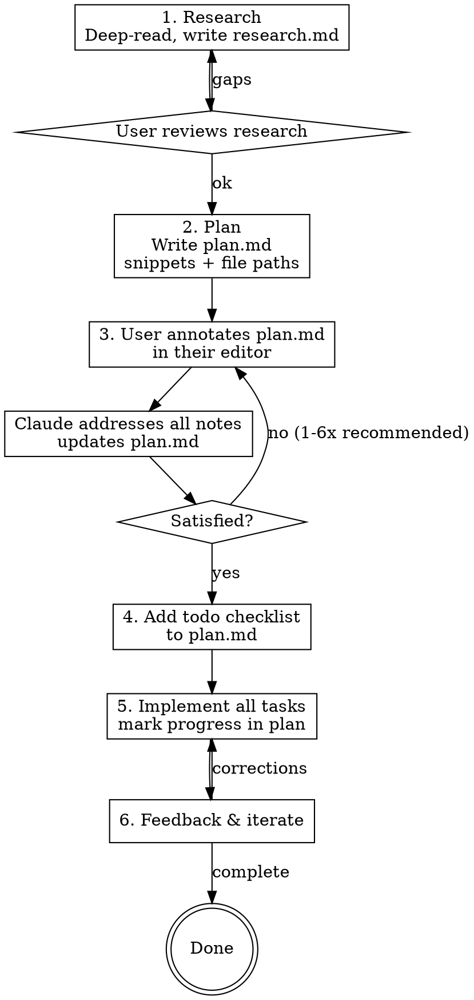

# Disciplined Workflow

## Overview

Never write code until a written plan has been reviewed and approved. Separate thinking from typing through a strict phase pipeline: research deeply, plan thoroughly, annotate until right, then execute without stopping.

## When to Use

- Non-trivial features, bugfixes, refactors
- Work touching unfamiliar or complex systems
- Changes where wrong assumptions cause cascading damage
- Any task where you'd regret skipping research

**Don't use for:** One-line fixes, typos, trivial config changes.

## Process

## Phase 1: Research

Explore the relevant codebase **deeply** — not surface-level skimming. Read implementations, trace data flows, understand intricacies.

**Output:** Write findings to `~/.claude/research/<topic>.md`
- Include Jira ticket ID in filename if user specifies one
- Cover: architecture, data flow, edge cases, existing patterns, gotchas

<HARD-GATE>
Do NOT proceed to planning until research.md exists and the user has reviewed it.
</HARD-GATE>

**Research depth** is determined by user direction or your judgment of what needs understanding. No minimum enforced — but err on the side of thoroughness. Surface-level research produces surface-level plans.

## Phase 2: Plan

Write a detailed implementation plan with code snippets, exact file paths, trade-offs, and considerations.

**Output:** Write to `~/.claude/plans/<topic>.md`
- Include Jira ticket ID in filename if user specifies one
- Include: approach explanation, code snippets of actual changes, file paths, trade-offs
- Reference existing code patterns when available — concrete references beat designing from scratch

<HARD-GATE>
Do NOT implement anything. The plan is a document for review, not a starting gun.
</HARD-GATE>

## Phase 3: Annotation Cycle

The user opens plan.md in their editor and adds inline notes — corrections, constraints, domain knowledge, rejections. Then sends you back to the document.

**When user says "I added notes":**
1. Re-read the plan document completely
2. Address every note — don't skip any
3. Update the plan accordingly
4. **Do NOT implement.** Say explicitly: "Plan updated. Ready for another round of notes, or should I add the todo list?"

This cycle repeats as many times as the user needs (typically 1-6x). The user decides when the plan is ready — not you.

## Phase 4: Todo List

When the user approves the plan, add a granular task checklist to the plan document:
- Organized by phases
- Individual tasks as checkbox items
- Granular enough to track progress during implementation

<HARD-GATE>
Do NOT begin implementation until the todo list is in the plan and the user says to proceed.
</HARD-GATE>

## Phase 5: Implementation

Execute all tasks from the plan. Standard implementation prompt:

- Implement everything in the plan — don't cherry-pick
- Mark tasks completed in plan.md as you go
- Don't stop until all tasks and phases are completed
- Don't add unnecessary comments or jsdocs
- Maintain strict typing (no `any` or `unknown`)
- Run typecheck/lint continuously to catch issues early
- Follow all commit, branch, and PR conventions from CLAUDE.md and user settings — including Conventional Commits format, branch naming prefixes, Jira ticket references in footers, and PR templates

## Phase 6: Feedback & Iterate

During implementation, accept terse corrections:
- "wider", "still cropped", "2px gap" — for visual issues
- "you didn't implement X" — for missed items
- "this should look like the users table" — reference existing code for consistency
- Screenshots for visual bugs

**When things go wrong direction:** Revert and re-scope. Narrowing scope after a revert beats patching a bad approach.

## Red Flags

| Thought | Reality |
|---------|---------|
| "I understand enough to start coding" | Write research.md first. |
| "The plan is good enough" | Has the user annotated? Wait. |
| "This annotation is minor, I can start" | Address all notes first. User decides when ready. |
| "I'll add the todo list as I go" | Todo list before implementation. |
| "Simple change, skip research" | Simple changes in complex systems cause the worst bugs. |
| "I know what they want" | The annotation cycle exists because you don't. |

## File Conventions

| Artifact | Location | Naming |
|----------|----------|--------|
| Research | `~/.claude/research/` | `<topic>.md` or `<ticket-id>-<topic>.md` |
| Plan | `~/.claude/plans/` | `<topic>-plan.md` or `<ticket-id>-<topic>-plan.md` |

User specifies Jira ticket ID when applicable.

## Quick Reference

| Phase | Output | Gate |
|-------|--------|------|
| Research | `~/.claude/research/<topic>.md` | User reviews before planning |
| Plan | `~/.claude/plans/<topic>.md` | No implementation until annotated |
| Annotate | Updated plan.md | User says "ready" before next phase |
| Todo | Checklist in plan.md | User approves before implementation |
| Implement | Code + marked tasks in plan | Run typecheck continuously |
| Feedback | Terse corrections | Revert if wrong direction |
