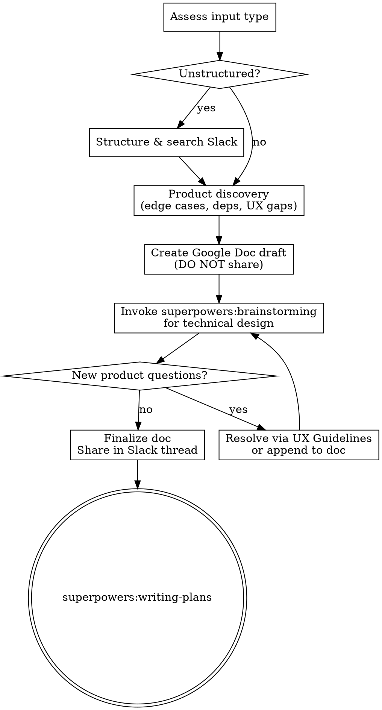

# Prep Discovery

Surface missing requirements, edge cases, and cross-team dependencies before technical design begins. Produces a Google Doc one-pager that accumulates findings through both product discovery and technical design phases.

<HARD-GATE>
Do NOT write any implementation code or start technical design until Phase 2 (Product Discovery) is complete and the Google Doc draft has been created. Phase 3 transitions into superpowers:brainstorming for technical design.
</HARD-GATE>

**Required MCP servers:** Slack, Google Docs, Workbench (Gusto design system)

## Process Flow

---

## Phase 1: Assess & Structure

Classify the input automatically — do not ask the engineer what type it is.

| Input Type | Signal | Action |
|------------|--------|--------|
| **Unstructured notes** | No clear sections, bullet fragments, Slack pastes, verbal notes | Structure into requirements, search Slack for context. Prioritize scope ambiguity and cross-feature interactions. |
| **PRD / formal doc** | Clear problem statement, success metrics, user stories | Full edge case discovery across all categories. |
| **PRD + designs** | Figma links, design doc, or reference to design work | Full discovery + validate design coverage against edge/error states. |

### When input is unstructured

1. Parse and group into: **Goal**, **User stories** (implied), **Known constraints**, **Open questions**
2. Search Slack channels for additional context — prior discussions, decisions, related work. Check:
   - `#payroll-prep-pod` (C03LP0XNEF6)
   - `#project-automated-payroll-prep` (C0960H2PBRS)
   - `#project-automated-payroll-prep-eng` (C09AX1CLJNP)
   - `#project-payroll-standardization` (C07GH9B0Q0Z)
   - `#assistedpayroll-comms-collab` (C0ADV1QBTMK)
3. Present the structured version to the engineer for confirmation before proceeding

### When input is formal

1. Summarize key requirements
2. Identify what's explicitly stated vs what's implied or assumed
3. Proceed directly to Phase 2

---

## Phase 2: Product Discovery

CRITICAL RULE FOR PHASE 2: You MUST ask ONLY ONE question at a time. After asking your question, you MUST STOP GENERATING and wait for the engineer's response. Under NO circumstances should you list multiple questions at once. Acknowledge the user's answer, then ask the next logical question.

The engineer can answer, say "not sure" (becomes an open question in the doc), or say "skip."

### 2a. Problem & Solution Frame

If not already present in requirements, surface these — try to get the engineer to answer:

- **Problem:** What's the problem? Who are the target users? How does this align with the long-term plan?
- **Solution:** High-level solution in 1-2 sentences. What's the hypothesis? What does good look like?
- **Success:** What does success look like? OKRs? Qualitative measures?

### 2b. Scope & Intent Clarity (highest priority for unstructured input)

- What's the V1 boundary? What's explicitly out of scope?
- Are there ambiguous requirements that PM and engineer could interpret differently?
- What assumptions are we making? Which are risky?

### 2c. Cross-Feature Interactions (highest priority for unstructured input)

- **Other payroll flows:** Which are affected? Regular, off-cycle, correction/reversal, contractor, PEO, dismissal?
- **Missing API fields or functionality** needed from Payroll Platform — flag these explicitly, they require cross-team coordination
- **Setup flags or configuration** needed from Payroll Setup / Permissions teams
- **Review step surfacing** — does the Delivery team need to show any of this in their review flow?
- **Comms needs** — do we need emails or push notifications? Coordinate with Comms Platform
- **Design system customizations** — are we diverging from Workbench? Flag for Design Systems team
- **ProdOps / Marketing** — does launch require coordination?

For each dependency identified: document what we need, why, and the team that owns it.

### 2d. User & Role Variations

- Payroll admin vs. accountant vs. manager — any experience differences?
- Employer vs. contractor — or can this be memberized (ee/ctr agnostic)?
- Permissions implications per role
- Limited access admin considerations

### 2e. Payroll State Considerations

- Behavior across payroll states: draft, blocked, submitted, in-progress, processed
- In-flight payrolls: what happens if this change hits mid-payroll?
- Mid-pay-period changes: timing edge cases
- Concurrent edits: two admins in the same payroll

### 2f. Data & Scale Edge Cases

- Missing, partial, or unexpected data
- Scale differences: 5 employees vs 500
- Migration: does this affect existing data or only new data going forward?

### 2g. User Flow Edge Cases

- Error states: what does the user see when things fail?
- Empty states: first-time experience, no data yet
- Loading states: skeleton vs spinner
- Undo/reversibility: can the user recover from mistakes?

### 2h. UX Gap Detection (when designs are NOT present)

- Flag areas that need design decisions
- Query Workbench MCP for existing components and patterns that could apply
- Search the codebase for existing error state patterns, modals, alerts, empty states in payroll prep
- For each gap: recommend "reuse existing pattern X" where applicable, or flag as "needs new design from Daron"
- Follow the UX Gap Resolution Guidelines below before escalating

### 2i. Design Validation (when designs ARE present)

- Error states covered?
- Empty states and loading states shown?
- Responsiveness / small screen considerations?
- Accessibility (meets Gusto checklist)?
- Alignment with Workbench patterns?

### 2j. Rollout & Tracking

- Event tracking: what events do we need? What do we need to measure?
- ProdOps / Marketing coordination needed for launch?
- Rollout plan: high-level phases with rough dates
- Feature flag strategy

---

## UX Gap Resolution Guidelines

When the skill encounters a UX gap, attempt resolution in this order before flagging to design.

### Tier 1: Self-Resolve (check existing standards)

**Copy & Content (most common question type — 28% of all design questions)**
- Query Workbench MCP for copy standards (capitalization, terminology)
- Search codebase for how similar copy is handled in adjacent features
- Follow existing conventions: e.g., "Net pay" not "Net Pay", consistent date formats
- Alert copy: match existing alert patterns in the same flow
- If copy follows an obvious existing convention: resolve and note "Resolved — matches existing pattern [reference]"

**Layout & Spacing (23% of design questions)**
- Query Workbench MCP for spacing tokens, breakpoint behaviors, component sizing
- Search codebase for how the same component is used elsewhere in payroll prep
- Common patterns: 12px/16px spacing, standard responsive breakpoints
- If layout matches a Workbench spec: resolve and note in doc

### Tier 2: Self-Resolve with Engineer Confirmation

**Common UX Patterns (13% of design questions)**
- Confirmation dialogs: destructive actions always get confirmation, non-destructive don't
- Loading states: skeleton for initial load, spinner for in-page updates
- Empty states: check existing empty state patterns in payroll prep views
- Tooltip vs toggletip: hover for supplementary info, toggletip for mobile-accessible
- Drawer vs modal: drawers for detail/edit flows, modals for confirmation/blocking decisions

**Component Selection**
- Check what similar features in payroll prep already use
- Follow Workbench migration guidance for legacy components
- Match existing payroll table column configurations

### Tier 3: Flag to Design

Escalate to design when:
- Net-new interaction pattern not covered by Workbench or existing codebase
- Copy involving product positioning or user-facing terminology decisions
- Mobile-specific designs where no existing pattern applies
- Novel states beyond standard empty/error/loading
- Figma interpretation conflicts (design says X, implementation constraint means Y)
- Component migration with no clear path

**Each flagged item in the doc must include:**
- The question
- What existing patterns were checked and why they don't apply
- A proposed recommendation if the engineer has one
- Priority: **blocking** (can't implement without answer) vs **non-blocking** (can implement with reasonable default and adjust later)

---

## Google Doc Output Structure

**Title:** `[Feature Name] — Discovery & Edge Cases`

Create using Google Docs MCP. Do NOT share until Phase 3 completes.

### Sections:

**1. Problem & Solution Frame**
- Problem, target users, alignment with long-term plan
- High-level solution (1-2 sentences), hypothesis
- Success criteria: OKRs, qualitative measures
- Link to source (PRD, Slack thread, ticket)

**2. Requirements Summary**
- Structured requirements (as-given or as-structured from notes)
- V1 scope: what's in, what's explicitly out

**3. Cross-Team Dependencies**
For each dependency: what we need, why, owning team, suggested contact

| Dependency | Team | What We Need | Blocking? |
|------------|------|-------------|-----------|
| Missing API fields | Payroll Platform | [specific fields] | Y/N |
| Setup flags | Payroll Setup / Permissions | [specific flags] | Y/N |
| Review step changes | Delivery | [what to surface] | Y/N |
| Notifications | Comms Platform | [email/push needs] | Y/N |
| Component divergence | Design Systems | [customizations] | Y/N |
| Launch coordination | ProdOps / Marketing | [what's needed] | Y/N |

**4. Edge Cases & Open Questions**

Each item marked as:
- **Resolved** — answer documented
- **Open for PM** — needs product input
- **Open for Design** — needs Daron
- **Open for Eng** — needs technical investigation

Organized by: Scope & intent | Cross-feature | User & role variations | Payroll states | Data & scale | User flow

**5. UX Gaps** (when designs are not present)
- Areas needing design decisions (with context)
- Existing Workbench components that apply (from Workbench MCP)
- Existing codebase patterns found
- Each gap marked: reuse existing vs needs new design
- Resolution tier noted (self-resolved, engineer-confirmed, or flagged to design)

**6. Payroll Flow Impact Matrix**

| Flow | Affected? | Notes |
|------|-----------|-------|
| Regular payroll | | |
| Off-cycle | | |
| Correction/reversal | | |
| Contractor | | |
| PEO | | |
| Dismissal | | |

**7. Rollout & Tracking**
- Events to track, metrics needed
- ProdOps / Marketing coordination
- Rollout phases with rough dates
- Feature flag strategy

**8. Technical Design Notes** (added during Phase 3)
- Architecture and key decisions from brainstorming
- Technical risks and unknowns
- Questions surfaced during technical design (resolved or appended to Section 4)

---

## Phase 3: Transition to Technical Design

1. **Invoke `superpowers:brainstorming`** — pass the discovery findings as context for technical design
2. During brainstorming, when new product or UX questions surface:
   - Attempt resolution using the UX Gap Resolution Guidelines (Tier 1, then Tier 2)
   - If unresolvable: append to the Google Doc under the appropriate section
3. When brainstorming completes and transitions to `superpowers:writing-plans`:
   - Append **Technical Design Notes** (Section 8) to the Google Doc
   - Consolidate and deduplicate all open questions
   - Update status markers (questions answered during technical design become Resolved)
4. **Share the finalized doc** — post the Google Doc link in the Slack thread the engineer specifies, with a brief summary:
   > "Discovery doc ready for review — X open questions for PM, Y for design, Z cross-team dependencies identified"

---

## Common Payroll Prep Patterns Reference

When resolving UX gaps, these are the most frequent question categories engineers ask design about. Use this to anticipate and pre-resolve:

### Copy Standards
- Capitalization: sentence case for UI labels (e.g., "Net pay" not "Net Pay")
- Terminology: be consistent with existing usage in the same flow (e.g., "Correction" vs "Correction payment" — check what the flow already uses)
- Alert copy: match the tone and structure of existing alerts in the same feature area
- Date formats: follow whatever format adjacent features use

### Layout Defaults
- Spacing: default to Workbench tokens. Most common: 12px, 16px
- Responsive: always consider md breakpoint behavior — most layout questions arise here
- Button positioning: follow existing patterns in the same page/flow

### Interaction Patterns
- Destructive actions: always confirmation dialog
- Bulk operations: loading state on button, disable during processing
- Search: follow existing search behavior in the same product area
- Drawers: use for detail views and edit flows. Close on outside click.
- Modals: use for confirmations and blocking decisions only.

### State Handling
- Loading: skeleton on initial page load, spinner for in-page data fetches
- Empty: check existing empty states in payroll prep — reuse the pattern
- Error: check existing error handling in the same flow — match the pattern
- Crash states: section-specific crash boundaries preferred over full-page crashes
